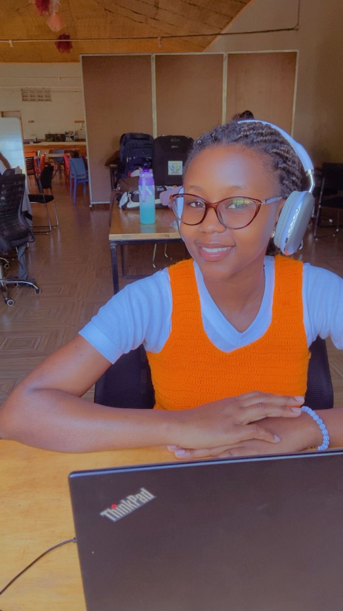

# Hi World, I'm Grace 👋

Software Developer passionate about building practical solutions with Python and Django.

## 👩🏽‍💻 About Me
- 🎓 Python Software Development Graduate
- 📚 Currently studying AI & Software Development
- 🌱 Learning JavaScript 
- 💡 Interested in Backend Development, APIs

## 🛠 Tech Stack

Python | Django | HTML | CSS | Bootstrap | Git | GitHub | SQL

## 🚀 Featured Projects

### 📚 Blessed Hands Bookshop Management System
A Django application for managing inventory, sales, suppliers, and reports.

### 🚗 ParkEase
Parking management system that calculates parking charges and manages vehicles.

### 🎥 Videx
Video upload and management application.

## 📫 Connect With Me
LinkedIn: https://www.linkedin.com/in/bawuza-grace-9826b0406/
Email: gracyb2025@gmail.com
